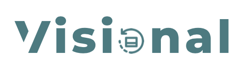

<div id="top"></div>

<br />
<div align="center">
  
</div>


<details>
  <summary>Table of Contents</summary>
  <ol>
    <li>
      <a href="#about-the-project">About The Project</a>
      <ul>
        <li><a href="#website-url">Website URL</a></li>
        <li><a href="#user">User</a></li>
        <li><a href="#realtor">Realtor</a></li>
        <li><a href="#admin">Admin</a></li>
        <li><a href="#built-with">Built With</a></li>
      </ul>
    </li>
    <li>
      <a href="#getting-started">Getting Started</a>
      <ul>
        <li><a href="#installation">Installation</a></li>
      </ul>
    </li>
    <li><a href="#author">Author</a></li>
  </ol>
</details>


## About The Project

[![Product Name Screen Shot][product-screenshot]](https://immoa.herokuapp.com/)

### Website URL

[immoa.herokuapp.com](https://immoa.herokuapp.com/)

    
### User

    Email: oliviadore@gmail.com	
    Password: olivia123


### Realtor

    Email: realtor@gmail.com
    Password: realtor123


### Admin

    Email: admin@gmail.com
    Password: admin123


<p align="right">(<a href="#top">back to top</a>)</p>


### Built With

This list includes the tools I used to create this application. I used:

* [React](https://reactjs.org/)
* [Typescript](https://www.typescriptlang.org/)
* [Tailwind](https://tailwindcss.com/)
* [Sass](https://sass-lang.com/)
* [React Icons](https://react-icons.github.io/react-icons/)
* [React Router](https://reacttraining.com/react-router/)

<p align="right">(<a href="#top">back to top</a>)</p>


## Getting Started

This is an example of how you may give instructions on setting up your project locally.
To get a local copy up and running follow these simple example steps.

### Installation

1. Clone the repo
   ```sh
   git clone https://github.com/gdmgent-2122-mobdev2/eindopdracht-keanovc.git
   ```
2. Change to the directory
    ```sh
    cd eindopdracht-keanovc
    ```

3. Install NPM packages
   ```sh
... (32 regels over)