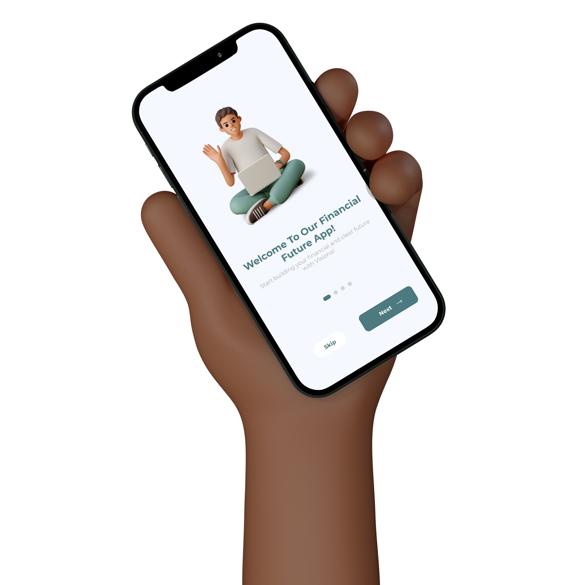

<div id="top"></div>

<br />
<div align="center">
  
</div>


<details>
  <summary>Table of Contents</summary>
  <ol>
    <li>
      <a href="#about-the-project">About The Project</a>
      <ul>
        <li><a href="#website-url">Website URL</a></li>
        <li><a href="#user">User</a></li>
        <li><a href="#realtor">Realtor</a></li>
        <li><a href="#admin">Admin</a></li>
        <li><a href="#built-with">Built With</a></li>
      </ul>
    </li>
    <li>
      <a href="#getting-started">Getting Started</a>
      <ul>
        <li><a href="#installation">Installation</a></li>
      </ul>
    </li>
    <li><a href="#author">Author</a></li>
  </ol>
</details>


## About The Project

<p align="center">
  
</p>

The topic of financial independence is relevant because it is becoming increasingly important to handle money wisely. Many young people are unaware of the financial responsibilities that come with standing on their own two feet and it is therefore necessary to provide them with the right tools and knowledge.

The concept behind my media product is an app called Visional, which helps young people manage their money. The app offers comprehensive budgeting and spending tracking, educational resources, goal setting and an AI chatbot to answer questions.

My target audience is young people aged between 18 and 24 who want an independent and financial future. I chose this target group because they are at a critical time in their lives and this period can determine their financial future. Visional offers them the opportunity to manage their money wisely and guide them towards financial independence.

### Expo URL

<a href="exp://exp.host/@keanovc/bachelor-thesis" target="_blank">exp://exp.host/@keanovc/bachelor-thesis</a>

    
### User

    Email: test@gmail.com
    password: test1234


<p align="right">(<a href="#top">back to top</a>)</p>


### Built With

This list includes the tools I used to create this application. I used:

* [React](https://reactjs.org/)
* [Typescript](https://www.typescriptlang.org/)
* [Tailwind](https://tailwindcss.com/)
* [Sass](https://sass-lang.com/)
* [React Icons](https://react-icons.github.io/react-icons/)
* [React Router](https://reacttraining.com/react-router/)

<p align="right">(<a href="#top">back to top</a>)</p>


## Getting Started

This is an example of how you may give instructions on setting up your project locally.
To get a local copy up and running follow these simple example steps.

### Installation

1. Clone the repo
   ```sh
   git clone https://github.com/gdmgent-2122-mobdev2/eindopdracht-keanovc.git
   ```
2. Change to the directory
    ```sh
    cd eindopdracht-keanovc
    ```

3. Install NPM packages
   ```sh
... (32 regels over)